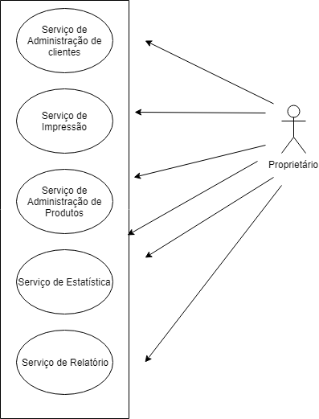
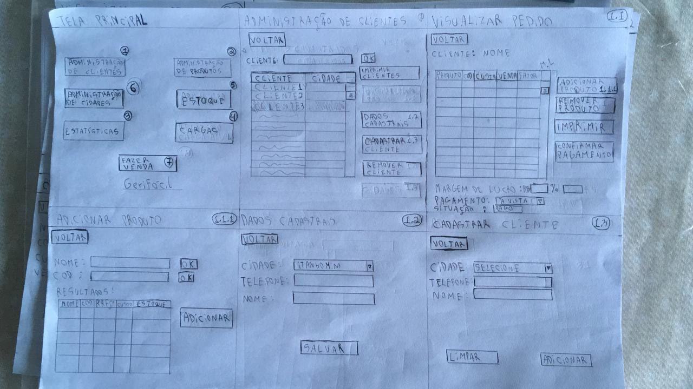
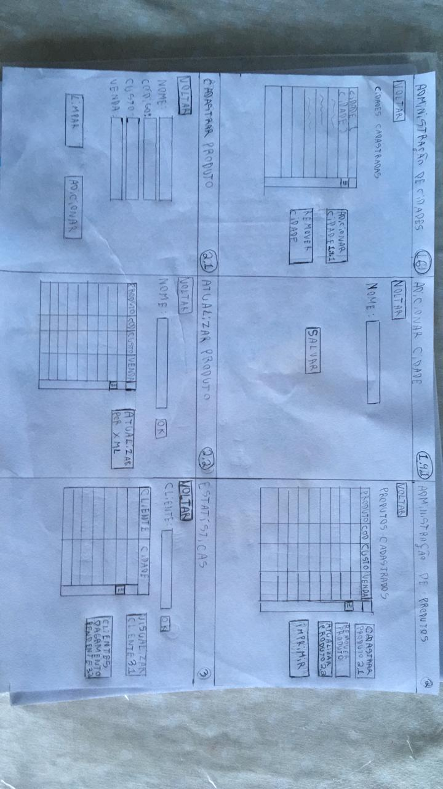
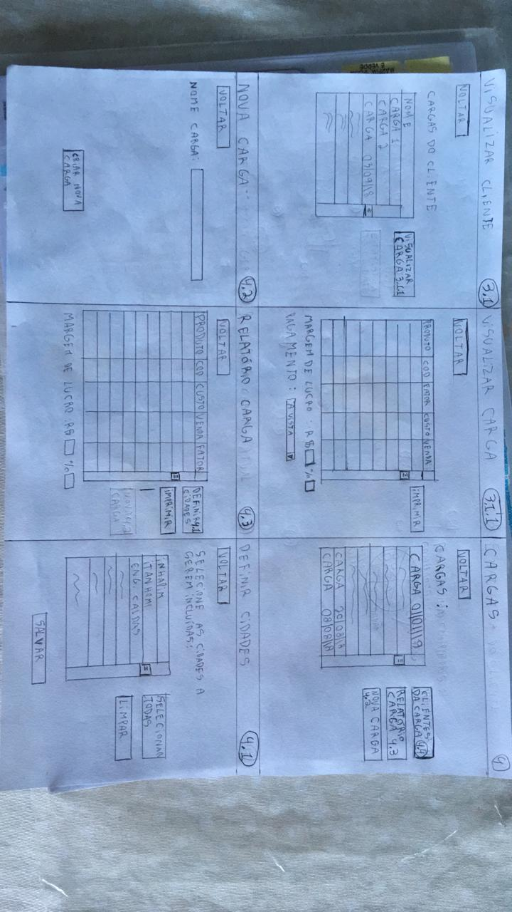
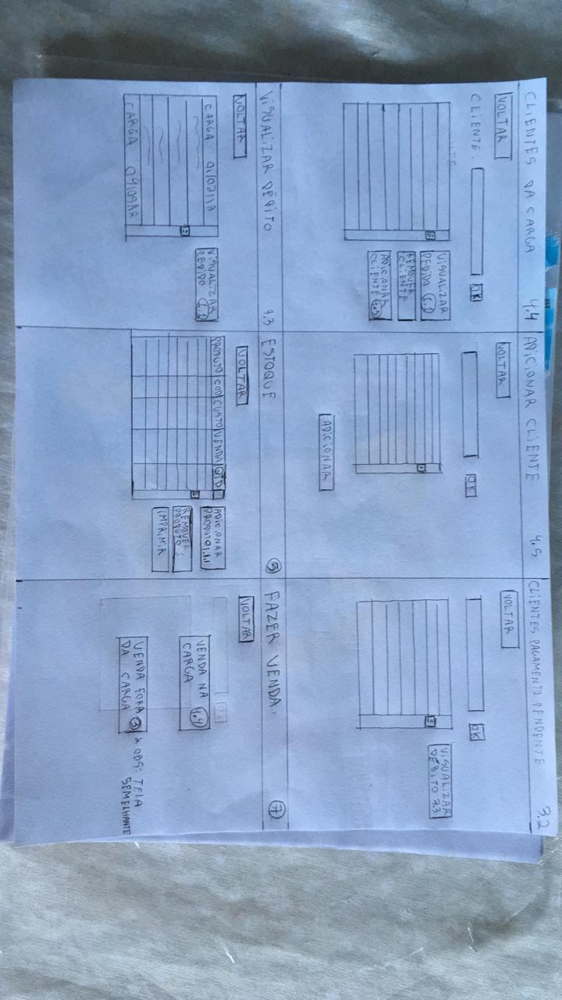

# geriFacil: Um software para revenda de produtos
Software desenvolvido para um revendendor que trabalha com venda de produtos para lojas e comércios, o revendendor gastava muito tempo coletando semanalmente os produtos que cada comerciante necessitava, tendo que, após coletar via anotações os produtos que cada lojista necessitava, elaborar uma planilha com o somatório de todos os produtos que precisava comprar em cada revenda.\
Com o geriFacil, o revendendor cadastra todos os produtos que revende e todos os seus clientes, colocando na tabela de cada cliente o tipo e a quantidade de cada produto, com isso, o software automatiza o processo de elaboração da planilha final com o somatório de todos os produtos que o revenendor deve comprar a cada revenda, economizando horas de trabalho manual, o geriFacil ainda possui opção de impressão da planilha de cada cliente ( serve como nota fiscal, devidamente assinada pelo revenendor e o comerciante), e também impressão da planilha final de cada revenda, há também a porcentagem de lucro sobre cada comerciante e o lucro total de cada revenda.

# Como executar
Para executar o geriFacil, é preciso ter [QT Creator](https://www.qt.io/download) instalado em sua máquina, no momento da instalação do QT Creator, na janela "Select Components", é necesário instalar o minGW contido na seção "Developer and Designer Tools", e de alguma seção do Qt 5.\
Depois de instalado o QT Creator, abra um projeto e selecione o arquivo GereFacil.pro, localizado dentro da pasta sources, e pronto, o QT Creator irá carregar o software e o iniciará.

# Especificação de requisitos ( Elaboração do software)

Software para gestão de vendas

GeriFácil

GeriFácil - Software para gestão de vendas

Especificação de Requisitos

Versão <1.0>

 

* * *

* * *

Índice

1.        Objetivo        

2.        Descrição do Produto                                                                           

        2.1 Escopo do Produto        

                 2.1.1   O que é?                                                                                                                                  

        2.1.2        Nome do produto e de seus componentes principais        

        2.1.3        Missão do produto        

        2.1.4        Escopo

        2.1.5\.  Escopo negativo/Limites do Produto        

        2.1.6        Benefícios do produto        

 2.2         Serviço oferecidos pelo produto                                                                              

        2.2.1        Diagrama de contexto        

        2.2.2        Descrição dos Serviços        

        2.2.3        Generalização dos Atores        

        2.2.4        Descrição dos Atores        

3.        Histórias de Usuário

4.        Backlog

4.1 Serviço de administração de clientes (CRUD)                                                        4.2        Serviço de impressão                                                                                4.3 Serviço de Administração de produtos(CRUD        )                                                4.4 Serviço de estatística                                                                                4.5         Serviço de relatório

5\.     Storyboard

6\.     Cronograma

        6.1 data das sprints

7.        Requisitos Não Funcionais

         7.1         Usabilidade

         7.2        Confiabilidade

          7.3        Portabilidade

                

* * *

Especificação de Requisitos  

#  1. Objetivo

Este documento tem objetivo de especificar os requisitos do GeriFácil, software de gestão de vendas.

#  2. Descrição do Produto

## 2.1. Escopo do Produto

### 2.1.1. O que é?

        Sistema de gestão,armazenamento,elaboração de estatísticas e relatórios  de vendas realizadas em carga de produtos.

### 2.1.2. Nome do produto e de seus componentes principais

        O nome atribuído ao produto é GeriFácil. E será composto de um sistema desktop.

### 2.1.3. Missão do produto

        Gerir,criar estatísticas e relatórios sobre as vendas de uma carga,para otimizar o tempo gasto na tarefa.

### 2.1.4. Escopo

        Possui autenticação para ter acesso ao Sistema

Possui uma tabela para cada cliente.

        Possuirá uma tabela com o registro de todos os produtos á venda.

        Possuirá uma tabela com os produtos que estão em estoque.

        À cada compra de produtos(carga), o sistema irá gerar uma tabela com a soma de produtos a serem comprados,podendo variar por região(cidade),mistura de regiões(cidades diferentes) ou o total das regiões(todas as cidades)

        O Sistema deverá armazenar um histórico de compras de cada cliente para análise

        O Sistema deverá auto-completar a inserção de produtos na tabela de um cliente.

        O Sistema deverá ter a opção de  imprimir qualquer tipo de tabela gerada.

         A cada carga realizada,as tabelas dos clientes deverão ser limpas para a próxima carga.

        O usuário terá autonomia para definir um preço de venda de um produto diferente para cada cliente,tendo com base,o valor de venda na tabela de produtos.

        O sistema poderá atualizar o valor de custo de um produto através de um arquivo .xls

        O sistema deverá dar o máximo de autonomia ao usuário,sendo o mais editável possível quanto ás informações apresentadas nas tabelas.

        

### 2.1.5. Escopo negativo/Limites do produto

Não haverá acesso via biometria.

Não haverá acesso por e-mail.

Não haverá forma automática de recuperação de senha.

Não haverá portabilidade das tabelas armazenadas no sistema.

### 2.1.6. Benefícios do produto

Com o GeriFácil,o usuário(a princípio Luciano) terá uma grande economia de tempo,pois até agora,toda a gestão das vendas de produtos está sendo feita á mão,tanto na coleta de dados(continuará assim) quanto na elaboração da tabela com os produtos a serem comprados em uma carga,esta tarefa consome horas,com o software,luciano terá grande economia de tempo na gestão do produto e ainda terá estatísticas quanto á seus clientes.

## 2.2. Serviço oferecidos pelo produto

### 2.2.1. Diagrama de contexto

Figura 1 – Diagrama de Contexto do Sistema

### 2.2.2. Descrição dos Serviços

        

        

<table class="c54">

<tbody>

<tr class="c18">

<td class="c20 c47" colspan="1" rowspan="1">

Número

</td>

<td class="c20 c47" colspan="1" rowspan="1">

Nome

</td>

<td class="c20 c47" colspan="1" rowspan="1">

Descrição

</td>

</tr>

<tr class="c18">

<td class="c20" colspan="1" rowspan="1">

1

</td>

<td class="c20" colspan="1" rowspan="1">

Serviço de Administração de Clientes

</td>

<td class="c20" colspan="1" rowspan="1">

Cria,atualiza,remove e visualiza

dados de clientes,como a tabela de compras,ou registros do estabelecimento.

</td>

</tr>

<tr class="c11">

<td class="c20" colspan="1" rowspan="1">

2

</td>

<td class="c20" colspan="1" rowspan="1">

Serviço de Impressão

</td>

<td class="c20" colspan="1" rowspan="1">

Imprime as tabelas e relatórios gerados no sistema

</td>

</tr>

<tr class="c11">

<td class="c20" colspan="1" rowspan="1">

3

</td>

<td class="c20" colspan="1" rowspan="1">

Serviço de Administração de Produtos

</td>

<td class="c20" colspan="1" rowspan="1">

Cria,atualiza, remove e visualiza produtos que o proprietário vende.

</td>

</tr>

<tr class="c11">

<td class="c20" colspan="1" rowspan="1">

4

</td>

<td class="c20" colspan="1" rowspan="1">

Serviço de Estatística

</td>

<td class="c20" colspan="1" rowspan="1">

Cria e mostra dados tratados de clientes específicos, ou de todos os clientes,também possui um histórico de compras por cliente.

</td>

</tr>

<tr class="c11">

<td class="c20" colspan="1" rowspan="1">

5

</td>

<td class="c20" colspan="1" rowspan="1">

Serviço de Relatório

</td>

<td class="c20" colspan="1" rowspan="1">

Gera um relatório da carga atual,com a soma por  produto que os clientes compraram.

</td>

</tr>

</tbody>

</table>

###  2.2.3 Generalização dos Atores

### 2.2.4  Descrição dos Atores

Proprietário: Dono do software e do negócio de revendas,irá utilizar o software.

# 3. Histórias de Usuário 

<table class="c54">

<tbody>

<tr class="c18">

<td class="c14" colspan="1" rowspan="1">

Serviço

</td>

<td class="c14" colspan="1" rowspan="1">

Como

</td>

<td class="c14" colspan="1" rowspan="1">

Eu quero

</td>

<td class="c14" colspan="1" rowspan="1">

Para que

</td>

<td class="c14" colspan="1" rowspan="1">

Sprint

</td>

</tr>

<tr class="c18">

<td class="c14" colspan="1" rowspan="1">

Administração de clientes

</td>

<td class="c14" colspan="1" rowspan="1">

Proprietário

</td>

<td class="c14" colspan="1" rowspan="1">

Adicionar um cliente

</td>

<td class="c14" colspan="1" rowspan="1">

Ele faça parte do sistema e dos relatórios

</td>

<td class="c14" colspan="1" rowspan="1">

1

</td>

</tr>

<tr class="c18">

<td class="c14" colspan="1" rowspan="1">

Administração de clientes

</td>

<td class="c14" colspan="1" rowspan="1">

Proprietário

</td>

<td class="c14" colspan="1" rowspan="1">

Atualizar os dados de um cliente

</td>

<td class="c14" colspan="1" rowspan="1">

As informações cadastrais do clientes se mantenham atualizadas para uma eventual consulta

</td>

<td class="c14" colspan="1" rowspan="1">

1

</td>

</tr>

<tr class="c18">

<td class="c14" colspan="1" rowspan="1">

Administração de clientes

</td>

<td class="c14" colspan="1" rowspan="1">

Proprietário

</td>

<td class="c14" colspan="1" rowspan="1">

Atualizar a tabela de um cliente da carga atual

</td>

<td class="c14" colspan="1" rowspan="1">

não falte produtos na compra da carga

</td>

<td class="c14" colspan="1" rowspan="1">

1

</td>

</tr>

<tr class="c18">

<td class="c14" colspan="1" rowspan="1">

Administração de clientes

</td>

<td class="c14" colspan="1" rowspan="1">

Proprietário

</td>

<td class="c14" colspan="1" rowspan="1">

Remover um cliente

</td>

<td class="c14" colspan="1" rowspan="1">

.Ele não esteja cadastrada no sistema.

</td>

<td class="c14" colspan="1" rowspan="1">

1

</td>

</tr>

<tr class="c18">

<td class="c14" colspan="1" rowspan="1">

Administração de clientes

</td>

<td class="c14" colspan="1" rowspan="1">

Proprietário

</td>

<td class="c14" colspan="1" rowspan="1">

Visualizar cargas passadas de um cliente

</td>

<td class="c14" colspan="1" rowspan="1">

analisar o histórico de compra de um cliente

</td>

<td class="c14" colspan="1" rowspan="1">

1

</td>

</tr>

<tr class="c18">

<td class="c14" colspan="1" rowspan="1">

Administração de clientes

</td>

<td class="c14" colspan="1" rowspan="1">

Proprietário

</td>

<td class="c14" colspan="1" rowspan="1">

Visualizar os dados cadastrais de um cliente

</td>

<td class="c14" colspan="1" rowspan="1">

obter alguma informação necessário do cliente

</td>

<td class="c14" colspan="1" rowspan="1">

1

</td>

</tr>

<tr class="c18">

<td class="c14" colspan="1" rowspan="1">

Administração de clientes

</td>

<td class="c14" colspan="1" rowspan="1">

Proprietário

</td>

<td class="c14" colspan="1" rowspan="1">

Visualizar carga atual de um cliente

</td>

<td class="c14" colspan="1" rowspan="1">

analisar a carga atual do cliente

</td>

<td class="c14" colspan="1" rowspan="1">

1

</td>

</tr>

<tr class="c18">

<td class="c14" colspan="1" rowspan="1">

Impressão

</td>

<td class="c14" colspan="1" rowspan="1">

Proprietário

</td>

<td class="c14" colspan="1" rowspan="1">

Imprimir o relatório da carga

</td>

<td class="c14" colspan="1" rowspan="1">

consiga acompanhar os pedidos sem a presença de um computador

</td>

<td class="c14" colspan="1" rowspan="1">

2

</td>

</tr>

<tr class="c18">

<td class="c14" colspan="1" rowspan="1">

Impressão

</td>

<td class="c14" colspan="1" rowspan="1">

Proprietário

</td>

<td class="c14" colspan="1" rowspan="1">

Imprimir pedidos da carga atual de um cliente

</td>

<td class="c14" colspan="1" rowspan="1">

posso entregá-lo uma segunda via do pedido.

</td>

<td class="c14" colspan="1" rowspan="1">

2

</td>

</tr>

<tr class="c18">

<td class="c14" colspan="1" rowspan="1">

Impressão

</td>

<td class="c14" colspan="1" rowspan="1">

Proprietário

</td>

<td class="c14" colspan="1" rowspan="1">

Imprimir histórico de pedidos de um cliente

</td>

<td class="c14" colspan="1" rowspan="1">

Poder acompanhar algum ocorrido,ou analisar as compras de um cliente

</td>

<td class="c14" colspan="1" rowspan="1">

2

</td>

</tr>

<tr class="c18">

<td class="c14" colspan="1" rowspan="1">

Impressão

</td>

<td class="c14" colspan="1" rowspan="1">

Proprietário

</td>

<td class="c14" colspan="1" rowspan="1">

Imprimir estatísticas gerais

</td>

<td class="c14" colspan="1" rowspan="1">

poder ter um relatório geral das vendas

</td>

<td class="c14" colspan="1" rowspan="1">

2

</td>

</tr>

<tr class="c18">

<td class="c14" colspan="1" rowspan="1">

Impressão

</td>

<td class="c14" colspan="1" rowspan="1">

Proprietário

</td>

<td class="c14" colspan="1" rowspan="1">

Imprimir estatísticas de um cliente

</td>

<td class="c14" colspan="1" rowspan="1">

poder ter um relatório de um cliente específico

</td>

<td class="c14" colspan="1" rowspan="1">

2

</td>

</tr>

<tr class="c18">

<td class="c14" colspan="1" rowspan="1">

Administração de produtos

</td>

<td class="c14" colspan="1" rowspan="1">

Proprietário

</td>

<td class="c14" colspan="1" rowspan="1">

Adicionar um produto

</td>

<td class="c14" colspan="1" rowspan="1">

poder tê-lo no sistema

</td>

<td class="c14" colspan="1" rowspan="1">

1

</td>

</tr>

<tr class="c18">

<td class="c14" colspan="1" rowspan="1">

Administração de produtos

</td>

<td class="c14" colspan="1" rowspan="1">

Proprietário

</td>

<td class="c14" colspan="1" rowspan="1">

Atualizar o preço de custo de um produto

</td>

<td class="c14" colspan="1" rowspan="1">

ter um preço atualizado

</td>

<td class="c14" colspan="1" rowspan="1">

1

</td>

</tr>

<tr class="c18">

<td class="c14" colspan="1" rowspan="1">

Administração de produtos

</td>

<td class="c14" colspan="1" rowspan="1">

Proprietário

</td>

<td class="c14" colspan="1" rowspan="1">

Atualizar o preço base de venda de um produto

</td>

<td class="c14" colspan="1" rowspan="1">

ter um preço atualizado

</td>

<td class="c14" colspan="1" rowspan="1">

1

</td>

</tr>

<tr class="c18">

<td class="c14" colspan="1" rowspan="1">

Administração de produtos

</td>

<td class="c14" colspan="1" rowspan="1">

Proprietário

</td>

<td class="c14" colspan="1" rowspan="1">

visualizar um produto

</td>

<td class="c14" colspan="1" rowspan="1">

checar as informações

</td>

<td class="c14" colspan="1" rowspan="1">

1

</td>

</tr>

<tr class="c18">

<td class="c14" colspan="1" rowspan="1">

Administração de produtos

</td>

<td class="c14" colspan="1" rowspan="1">

Proprietário

</td>

<td class="c14" colspan="1" rowspan="1">

Remover um produto

</td>

<td class="c14" colspan="1" rowspan="1">

não fazer parte do sistema

</td>

<td class="c14" colspan="1" rowspan="1">

1

</td>

</tr>

<tr class="c18">

<td class="c14" colspan="1" rowspan="1">

Estatística

</td>

<td class="c14" colspan="1" rowspan="1">

Proprietário

</td>

<td class="c14" colspan="1" rowspan="1">

visualizar as estatísticas de uma carga

</td>

<td class="c14" colspan="1" rowspan="1">

ter insights sobre as vendas,controle.

</td>

<td class="c14" colspan="1" rowspan="1">

3

</td>

</tr>

<tr class="c18">

<td class="c14" colspan="1" rowspan="1">

Estatística

</td>

<td class="c14" colspan="1" rowspan="1">

Proprietário

</td>

<td class="c14" colspan="1" rowspan="1">

visualizar as estatísticas de um cliente

</td>

<td class="c14" colspan="1" rowspan="1">

ter insights,controle sobre um cliente.

</td>

<td class="c14" colspan="1" rowspan="1">

3

</td>

</tr>

<tr class="c18">

<td class="c14" colspan="1" rowspan="1">

Relatório

</td>

<td class="c14" colspan="1" rowspan="1">

Proprietário

</td>

<td class="c14" colspan="1" rowspan="1">

visualizar o relatório da carga atual

</td>

<td class="c14" colspan="1" rowspan="1">

ter noção/controle sobre os pedidos a serem comprados na carga

</td>

<td class="c14" colspan="1" rowspan="1">

2

</td>

</tr>

</tbody>

</table>

# 4. Backlog

## 4.1. Serviço de Administração de clientes(CRUD)

Funcionalidade 1.1 – Criar Cliente: Verifica se há algum cliente com o mesmo nome de usuário,autoriza ou não a criação de um novo cliente,se autorizado cria o cliente.

Funcionalidade 1.2 – Visualizar Cliente: Permite visualizar os dados de cadastro,os produtos comprados por carga, e estatísticas de um cliente cadastrado.

Funcionalidade 1.3 – Editar Cliente: Disponibiliza campos editáveis e autoriza ou não a mudança dos mesmos,também disponibiliza a tabela da carga atual do respectivo cliente para atualização..

Funcionalidade 1.4 – Apagar Cliente: Efetiva a exclusão da conta de um cliente.

## 4.2. Serviço de Impressão

Funcionalidade 1.1 –  Imprimir tabela gerada: disponibiliza a opção de impressão de qualquer tabela gerada,e também dos dados cadastrais de um cliente

## 4.3. Serviço de Administração de produtos(CRUD)

Funcionalidade 1.1 – Criar Produto: Verifica se há algum produto com o mesmo nome de usuário,autoriza ou não a criação de um novo produto,se autorizado cria o produto.

Funcionalidade 1.2 – Visualizar Produto: Permite visualizar os dados de um produto cadastrado.

Funcionalidade 1.3 – Editar Produto: possibilidade de atualizar os produtos cadastrados através de um arquivo .xls de notas fiscais do local onde os produtos são adquiridos,também deverá ser possível atualizar um produto inserindo dados pelo teclado.

Funcionalidade 1.4 – Apagar Cliente: Efetiva a exclusão de um produto.

### 4.4. Serviço de Estatística

Funcionalidade 1.1 - Estatísticas de todos os clientes : Deverá mostrar os clientes que mais compram,a região que mais comprou,os cliente que não compram há mais de 2 cargas.os produtos mais comprados e os menos comprado.

Funcionalidade 1.2 - Estatística por cliente : Deverá mostrar os produtos mais comprados e os menos comprados,a última carga que o cliente comprou.

Funcionalidade 1.2- Histórico de compras : Deverá mostrar todas as compras de um cliente por carga.

### 4.5 Serviço de Relatório

Funcionalidade 1.1 - Elaboração de relatório geral : Cria um relatório em forma de tabela com a soma dos produtos a serem comprados na carga, o relatório poderá ser de uma região específica(cidade),composição de regiões,ou de todas as regiões,o relatório terá que levar em conta os produtos encontrados no estoque.

# 5. Storyboard

# 6. Cronograma

        O desenvolvimento do software divide-se em três sprints, todas com duração de 10 dias.

        A sprint 1 implementará o serviço de administração de clientes e o serviço de administração de produtos A sprint 2 implementará o serviço de impressão e o serviço de relatório, a sprint 3 implementará o serviço de estatística.

## 6.1 Data das sprints

Sprint 1 (01/01/19 á 10/01/19)

Sprint 2 (11/10/19 á 20/01/19)

Sprint 3(21/01/19 à 31/01/19)

 

# 7. Requisitos Não Funcionais

## 7.1. Usabilidade

1.   Nível de habilidade do usuário – O sistema deve ser o mais intuitivo e simples possível a fim de minimizar o tempo de uso.

## 7.2. Confiabilidade

1.  Disponibilidade – O sistema deve estar disponível 24 horas por dia, 7 dias por semana.

## 7.3. Portabilidade

1.  Linguagem de programação: C++,Framework QT
2.  Sistema Operacional: Windows

<table class="c52">

<tbody>

<tr class="c18">

<td class="c27" colspan="1" rowspan="1">

Restrito

</td>

<td class="c27" colspan="1" rowspan="1">

©GeriFácil, 2018

</td>

<td class="c27" colspan="1" rowspan="1">

Página

</td>

</tr>

</tbody>

</table>

